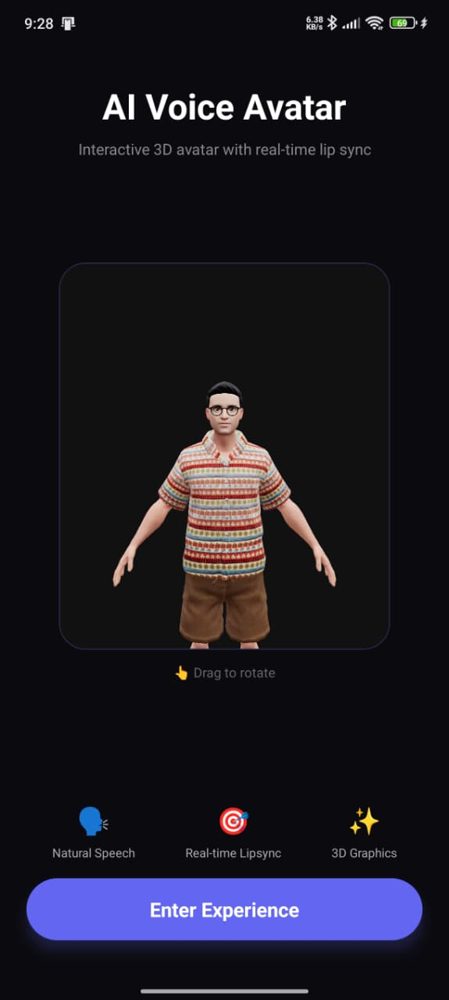
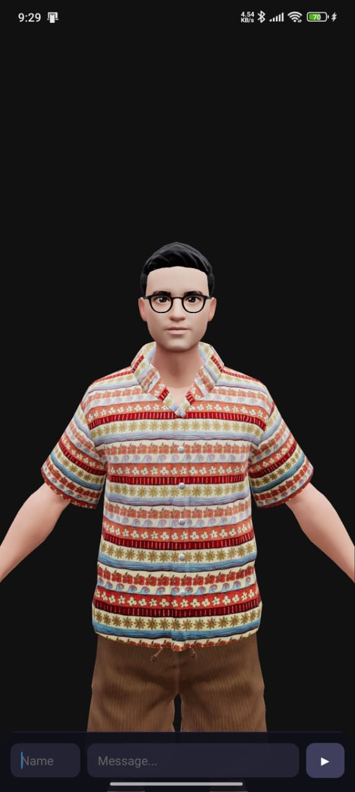
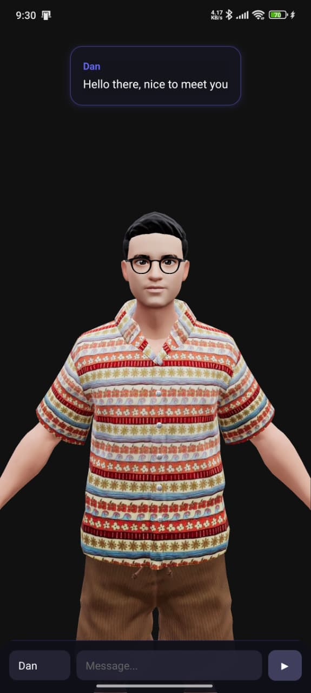

# 🎭 AI Voice Avatar

A React Native mobile app featuring an interactive 3D avatar with real-time lip sync animation. Type a message, and watch the avatar speak it with synchronized mouth movements.


---

## ✨ Features

- 🎭 **Interactive 3D Avatar** - Ready Player Me avatar with morph targets
- 🗣️ **Real-time Lipsync** - Mouth movements synchronized with speech
- 🔊 **Text-to-Speech** - Uses device TTS via expo-speech
- 👆 **Touch Controls** - Drag to rotate the avatar
- 📱 **Cross-platform** - Works on iOS, Android, and Web

---

## 📸 Screenshots

| Landing Page | Experience Screen | Speaking |
|:---:|:---:|:---:|
|  |  |  |
---

## 🎬 Demo Video

https://www.awesomescreenshot.com/video/47481167?key=f7c82e1614f9e363b85fb1a1c70f03a0


---

## 🛠️ Tech Stack

| Technology | Purpose |
|------------|---------|
| **Expo SDK 54** | React Native framework with managed workflow |
| **React Three Fiber** | React renderer for Three.js |
| **Three.js** | 3D rendering engine |
| **@react-three/drei** | Useful helpers for R3F (OrbitControls, Environment, etc.) |
| **expo-gl** | OpenGL ES support for React Native |
| **expo-speech** | Cross-platform Text-to-Speech |
| **wawa-lipsync** | Viseme-based lip sync mapping |
| **Ready Player Me** | 3D avatar with morph targets |

---

## 🚀 Getting Started

### Prerequisites

- Node.js 18+ 
- npm or yarn
- Expo CLI (`npm install -g expo-cli`)
- iOS Simulator / Android Emulator / Expo Go app

### Installation

```bash
# Clone the repository
git clone https://github.com/yourusername/ai-voice-call.git
cd ai-voice-call

# Install dependencies
npm install

# Start the development server
npx expo start --clear
```

### Running the App

After starting the dev server:

- **iOS Simulator**: Press `i`
- **Android Emulator**: Press `a`  
- **Web Browser**: Press `w`
- **Expo Go (physical device)**: Scan the QR code

---

## 📁 Project Structure

```
ai-voice-call/
├── app/
│   ├── _layout.tsx      # Root layout with navigation
│   ├── index.tsx        # Landing screen
│   └── experience.tsx   # Main avatar experience
├── components/
│   ├── Avatar.tsx       # 3D avatar with lipsync
│   └── SceneContainer.tsx # R3F Canvas setup
├── hooks/
│   └── useLipsync.ts    # Lipsync logic & TTS
├── services/
│   └── *.ts             # TTS service integrations
└── assets/
    └── screenshots/     # App screenshots
```

---

## 🎯 How It Works

1. **Avatar Loading**: Ready Player Me GLB model loaded via `useGLTF`
2. **Morph Targets**: Avatar has `mouthOpen` and `mouthSmile` blend shapes
3. **TTS**: `expo-speech` speaks the text aloud
4. **Animation**: Character-to-viseme mapping drives mouth shapes at 60fps
5. **Smooth Lerping**: Blendshape values interpolate smoothly

---

## 🔧 Configuration

### Using a Custom Avatar

Replace the avatar URL in `components/Avatar.tsx`:

```typescript
const DEFAULT_AVATAR_URL = 'https://models.readyplayer.me/YOUR_AVATAR_ID.glb';
```

Generate avatars at [readyplayer.me](https://readyplayer.me)

### Adjusting Speech Rate

In `hooks/useLipsync.ts`, modify the speech rate:

```typescript
Speech.speak(text, {
    rate: 0.8, // 0.1 (slow) to 2.0 (fast)
});
```

---

## 📜 License

MIT License - feel free to use this project for personal or commercial purposes.

---

## 🤝 Contributing

Contributions are welcome! Please open an issue or submit a PR.

---

<p align="center">
  Made with ❤️ using React Native + Three.js
</p>
